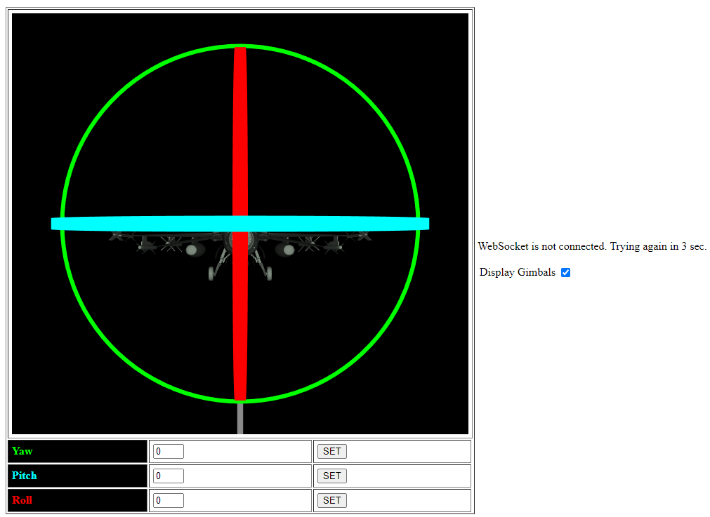
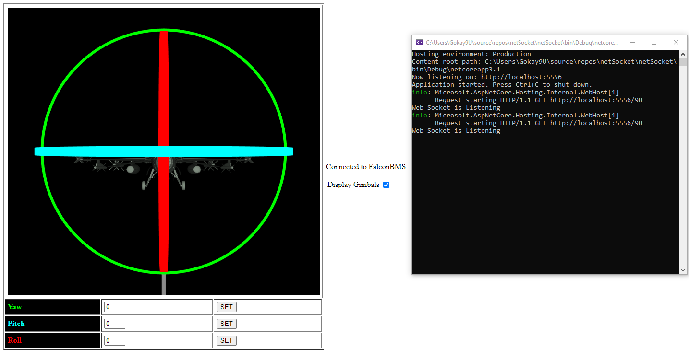

# FalconBMS_AircraftPrincipalAxes
Instant view of aircraft principal axes on local website with using WebSocket protocol.

First open index.html

And then run 
#### [Falcon BMS netSocket](https://github.com/Gokay9U/FalconBMS_AircraftPrincipalAxes/releases/download/v0.1/Program.zip)
It'll connect by itself.

